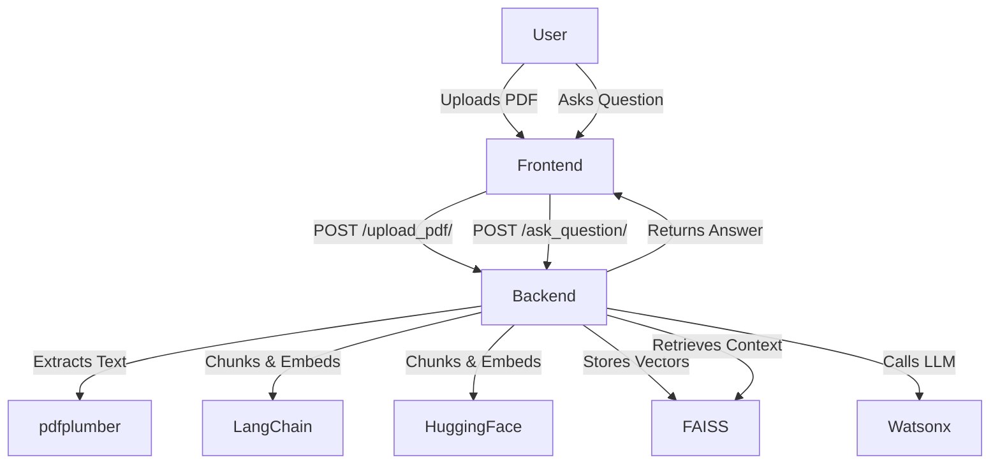

# DocBudAI

Chat with your PDF documents using advanced AI. Upload a PDF, ask questions, and get instant, context-aware answers. Powered by FastAPI,  Next.js, LangChain, FAISS, HuggingFace, and IBM Watsonx.

---

## Table of Contents
- [Features](#features)
- [Tech Stack](#tech-stack)
- [Architecture](#architecture)
- [Setup Instructions](#setup-instructions)
  - [Backend](#backend)
  - [Frontend](#frontend)
- [Configuration](#configuration)
- [Usage](#usage)
- [Folder Structure](#folder-structure)

---

## Features
- Upload any PDF and chat with its content using AI
- Fast, context-aware answers powered by IBM Watsonx LLM
- Secure: PDFs are processed in-memory and not stored permanently
- Supports research papers, reports, manuals, and more
- Modern, responsive web UI (Next.js + Tailwind CSS)
- Conversation history and multi-document support

---

## Tech Stack

### Backend
- **FastAPI**: REST API for PDF upload and Q&A
- **LangChain**: Text chunking and context management
- **FAISS**: Vector search for semantic retrieval
- **HuggingFace Sentence Transformers**: Embeddings
- **pdfplumber**: PDF text extraction
- **IBM Watsonx**: LLM for question answering
- **python-dotenv**: Environment variable management
- **Uvicorn**: ASGI server

### Frontend
- **Next.js 13**: React framework (App Router)
- **Tailwind CSS**: Utility-first styling
- **Radix UI**: Accessible UI components
- **TypeScript**: Type safety
- **Axios**: HTTP requests


---

## Architecture



---

## Setup Instructions

### 1. Clone the Repository
```bash
git clone <your-repo-url>
```

### 2. Backend Setup
```bash
python -m venv venv
source venv/bin/activate  # On Windows: venv\Scripts\activate
pip install -r requirements.txt
```

#### Environment Variables
Create a `.env` file in the root or backend directory with:
```
WATSONX_API_KEY=your_ibm_watsonx_api_key
WATSONX_URL=your_ibm_watsonx_project_url
PROJECT_ID=your_ibm_watsonx_project_id
```

#### Run Backend
```bash
uvicorn backend.main:app --reload
```

### 3. Frontend Setup
```bash
cd frontend
npm install
```

#### Run Frontend
```bash
npm run dev
```
The app will be available at `http://localhost:3000`.


---

## Configuration
- **.env**: Store all API keys and sensitive info here (never commit to git)
- **vector_store/**: Stores FAISS vector indexes (auto-generated, git-ignored)
- **venv/**: Python virtual environment (git-ignored)

---

## Usage
1. Open the frontend (`http://localhost:3000`)
2. Upload a PDF document
3. Ask questions in natural language
4. Get instant, context-aware answers
5. View conversation history and switch between documents

---

## Folder Structure
```
DocBudAI/
├── app.py                # Streamlit app (optional)
├── backend/
│   ├── main.py           # FastAPI backend
│   ├── pdf_utils.py      # PDF text extraction
│   ├── qa_engine.py      # Vector search & Watsonx integration
│   ├── watson_utils.py   # IBM Watson NLU utilities
│   └── vector_store/     # FAISS vector indexes
├── frontend/             # Next.js 13 frontend
│   ├── app/              # App Router pages
│   ├── components/       # UI components
│   ├── hooks/            # Custom hooks
│   ├── lib/              # Utilities
│   ├── ...
├── requirements.txt      # Python dependencies
├── .gitignore            # Git ignore rules
└── README.md             # Project documentation
```

---

## Credits
- Built with IBM Watsonx, LangChain, HuggingFace, Next.js, FastAPI.
